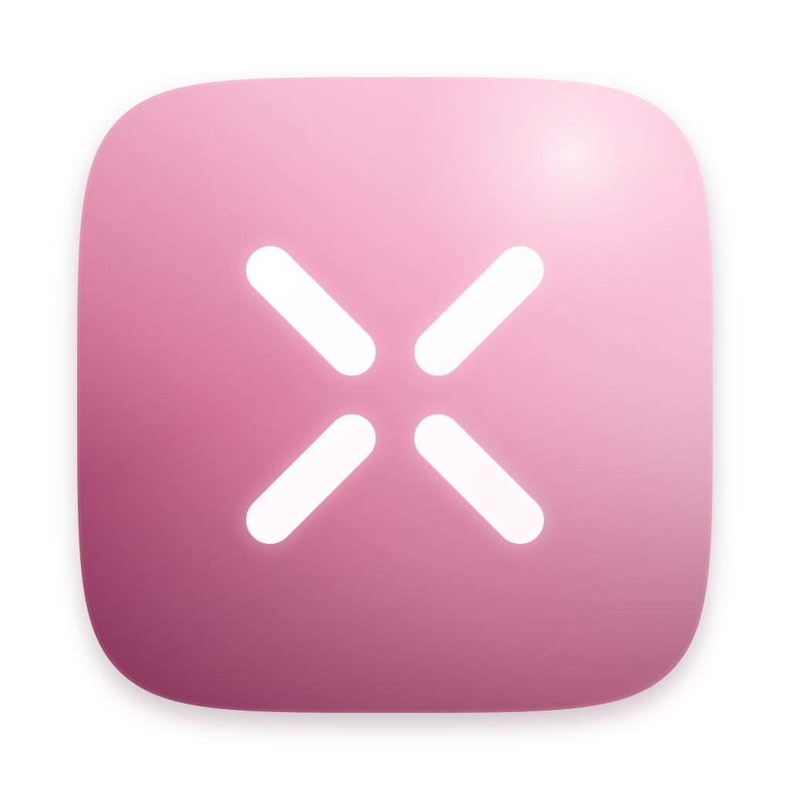
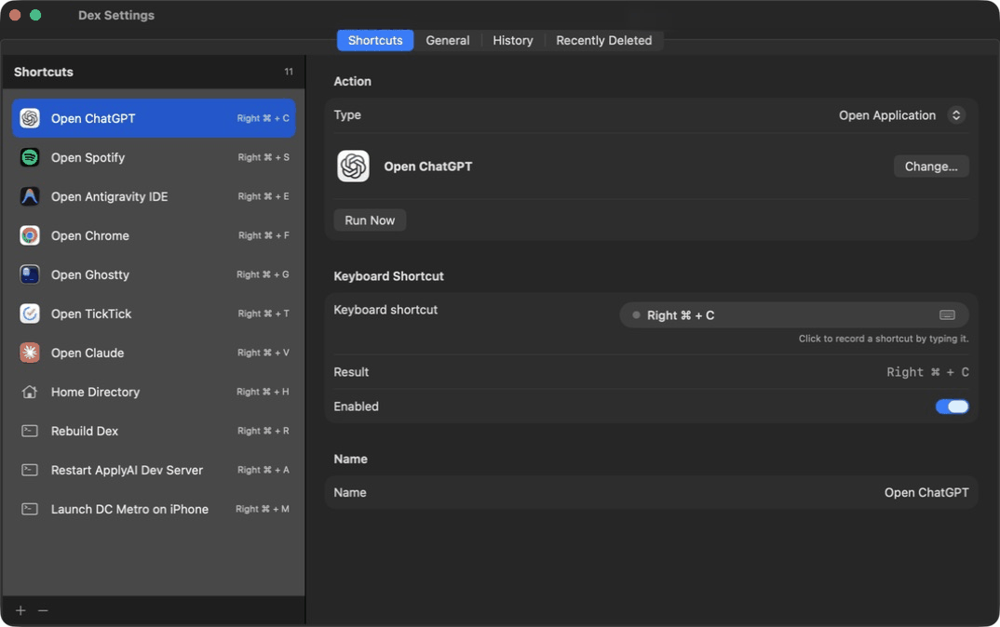

<div align="center">
  

  # DEX

  **A native macOS shortcut layer for the way you actually work.**

  Hold one physical modifier, tap a key, and jump to an app, folder, URL, Apple Shortcut, or development command.

  
  
  
</div>

<p align="center">
  
</p>

DEX turns a normally underused physical modifier—**Right Command** by default—into a personal command palette that lives in muscle memory. It stays out of the way in the menu bar and gives each key a useful job.

## Why I built it

I spend a lot of time moving between windows, terminals, browsers, and tools. After I started using and enjoying [Magnet](https://magnet.crowdcafe.com/) for fast window management, I wanted that same immediate, keyboard-first feeling for the rest of my Mac.

DEX is my answer: one modifier becomes a layer of shortcuts shaped around whatever I am doing that week. I also like being able to ask Claude or Codex to add or edit one for me—“make a shortcut that restarts this local dev server,” for example—without breaking focus to wire it up by hand.

### Window Drill

DEX also includes a practice mode for building the handoff between DEX and Magnet into muscle memory. Choose a set of open windows and layout families, then work through timed rounds: DEX shows which window to summon and where Magnet should place it, verifies the final geometry, scores the round, and advances automatically. DEX observes window positions for the drill; it never moves the windows itself. Magnet is optional for DEX's shortcut features and is only used by this training workflow.

Open **Window Drill…** from the DEX menu-bar menu to choose 5, 10, or 15 rounds, a time limit, a display, and layouts such as halves, thirds, two-thirds, quarters, or full screen.

## What DEX can do

| Action | Example |
| --- | --- |
| Open an application | `Right ⌘ + C` → ChatGPT |
| Open Finder | Jump directly to a project or home directory |
| Run a command | Restart a dev server in its working directory |
| Open a URL | Go straight to a dashboard or local environment |
| Run an Apple Shortcut | Trigger an existing macOS automation |

Bindings can also include Shift, Control, Option, or Command in addition to the physical trigger. DEX consumes matched key presses so the foreground app does not receive them; unmatched combinations keep their normal macOS behavior.

## Quick start

DEX requires **macOS 14 or newer**.

### Download DEX — recommended

1. Download `Dex.dmg` from the [latest GitHub release](https://github.com/dantome/dex/releases/latest).
2. Open the disk image and drag **Dex** to **Applications**.
3. Open Dex, then use its menu-bar icon to choose **Settings…**.
4. Grant **Accessibility** access when macOS asks. If prompted for **Input Monitoring**, enable Dex there too and relaunch it.
5. Add a shortcut, choose an action, and record a key.
6. Hold **Right Command** (the default trigger) and press that key.

Release builds are signed with a Developer ID certificate and notarized by Apple. You do not need Xcode, an Apple developer account, or the Mac App Store to install them. macOS still requires you to approve Accessibility access because DEX listens for the shortcuts you configure.

### Build and customize from source

Use this path if you want to inspect the code, change DEX itself, or contribute. It requires the full Xcode toolchain.

```sh
git clone https://github.com/dantome/dex.git
cd dex
./scripts/install.sh
```

The local installer builds `Dex.app`, copies it to `~/Applications`, and opens it. It uses an available Developer ID or Apple Development identity when possible, otherwise it falls back to ad-hoc signing. Ad-hoc builds work without a paid developer account, but macOS may show additional Gatekeeper prompts or ask you to grant Accessibility access again after rebuilding. Set `DEX_SIGNING_IDENTITY` to use a specific local identity.

For a development build without installation, run `swift run Dex`. The packaged app is the better choice when testing macOS permissions.

Downloading a release does not limit customization: shortcuts, commands, URLs, folders, and the trigger key are stored in your user configuration outside the signed app. Forking and rebuilding is only necessary when changing DEX's Swift code.

## Ask AI to make any shortcut

This repository includes the [`customize-dex`](.agents/skills/customize-dex/SKILL.md) skill. From the repository root, open a new Codex task and invoke it by name:

```text
Use $customize-dex to make Right Command + R restart the local dev server for this project.
```

More ideas:

```text
Use $customize-dex to bind Right Command + C to ChatGPT.
Use $customize-dex to open this project in Finder with Right Command + H.
Use $customize-dex to add a shortcut for my local dashboard URL.
```

Agents that discover repo-local skills will load it automatically when your request matches. If your AI tool does not, point it directly at `.agents/skills/customize-dex/SKILL.md`. The skill teaches the agent DEX's configuration format, safe editing workflow, key codes, validation rules, and how to apply changes without losing existing shortcuts.

You can still configure everything manually in **Settings → Shortcuts**. The **General** tab also contains a validated JSON editor and a copy button for moving a complete setup to another Mac.

## Useful details

- Choose Right Command, Right Option, Fn/Globe, or a supported left/control key as the global trigger.
- Run long-lived commands in a visible Terminal session, or run background commands and append output to `~/Library/Application Support/Dex/dex.log`.
- Keep deleted shortcuts in **Recently Deleted** for 30 days and restore them when needed.
- Review the newest 1,000 shortcut runs in **History**.
- Hide the menu-bar item while shortcuts continue running; reopen DEX from Applications or Spotlight.
- Move a complete configuration between Macs with the JSON editor. App and folder paths may need adjustment.

## Security

DEX runs as the current macOS user and never elevates privileges. App, URL, Finder, and Apple Shortcut actions use native system APIs or tools. Shell actions can run arbitrary commands with your permissions, so review them before saving.

Configuration and history are stored privately with `0600` permissions:

```text
~/Library/Application Support/Dex/shortcuts.json
~/Library/Application Support/Dex/history.json
```

## License

DEX is available under the [MIT License](LICENSE). Fork it, adapt it, and make the shortcut layer your own.

## Development

```sh
swift build
swift test
./scripts/build-app.sh release
```

The package is intentionally small:

- `DexCore` contains Codable models, key definitions, persistence, history, and shared utilities.
- `Dex` contains the SwiftUI/AppKit menu-bar app, global event tap, settings UI, and action execution.

After editing `Resources/DexAppIcon.svg`, regenerate the packaged icon with `./scripts/generate-icons.sh`.

### Publishing a release

Public releases use a separate, fail-closed workflow: a **Developer ID Application** identity, hardened runtime, secure timestamp, Apple notarization, and a stapled ticket are all required. The local build's ad-hoc fallback is never accepted for a release.

After storing notarization credentials in Keychain with `notarytool`, maintainers can build a release disk image with:

```sh
DEX_NOTARY_PROFILE=DEX_NOTARY ./scripts/release.sh
```

The script verifies the signature and notarization ticket and writes the upload-ready disk image to `dist/`. See [`docs/RELEASING.md`](docs/RELEASING.md) for the one-time certificate setup and complete checklist.

---

<p align="center"><sub>Built for fewer context switches and faster muscle memory.</sub></p>
